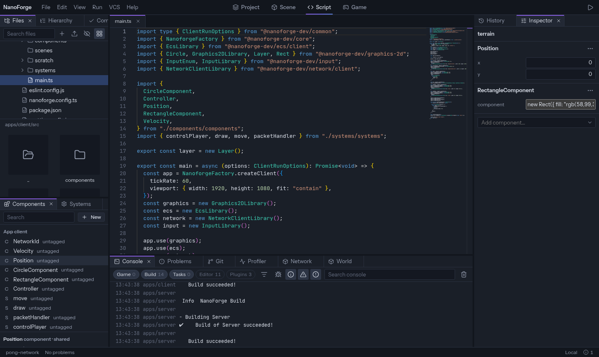

The **Script** screen is a code editor with what an IDE has: completion, types of your code and of the engine, errors as you type, go to definition, rename, formatting.

## Tabs and split

Each open file is a tab. A tab follows its file when it is renamed or moved, and closes when the file is deleted (unless it has unsaved changes). `Ctrl+\` splits the editor in two groups side by side, each with its own tabs. `Alt+W` or a middle click closes a tab.

## Saving

- `Ctrl+S` saves the file, and `Ctrl+K` then `S` saves them all; a dot on the tab marks unsaved changes.
- Unsaved changes survive a reload of the page: they are kept until you save or revert.
- **Play saves every open file first** (the _Save all before Play_ setting).

_Settings › Editor › Code editor_ has the automatic options, under _Saving_ and _Actions on save_:

| Setting                          | Does                                                             |
| -------------------------------- | ---------------------------------------------------------------- |
| Save after a delay               | Saves when you stopped typing for a moment.                      |
| Save when the editor loses focus | Saves when you leave the editor, switch tab or leave the window. |
| Reformat with Prettier on save   | Reformats at each save.                                          |
| Organize imports on save         | Sorts and cleans the imports of TypeScript and JavaScript files. |

## Find your way in the code

| To                         | Press                  |
| -------------------------- | ---------------------- |
| Go to definition           | `F12`, or `Ctrl`+click |
| Open a file by name        | `Ctrl+P`               |
| Go to a line               | `Ctrl+G`               |
| Go to a symbol of the file | `Ctrl+Shift+O`         |
| Rename a symbol everywhere | `F2`                   |
| Format the file            | `Shift+Alt+F`          |
| Organize imports           | `Shift+Alt+O`          |

Definitions inside engine packages (`@nanoforge-dev/*`) and installed packages open read-only.

## Errors

TypeScript errors are underlined in the code and listed in the **Problems** panel, for every file of the project, open or not. A failed build adds its errors there too.

## Formatting

Formatting uses **the project's own Prettier**, with its configuration and plugins. A hosted editor uses a built-in Prettier with the project's `.prettierrc`.

## When a file changes on disk

A file without unsaved changes reloads silently. A file **with** unsaved changes shows a banner: **Compare** (your version next to the one on disk), **Keep mine**, or **Load disk version**.

## Panels beside the code

When the open file defines a component, a **Component** panel can show next to the code (a toggle in the editor's toolbar): see [Components](components#how-a-component-looks-in-the-inspector).
