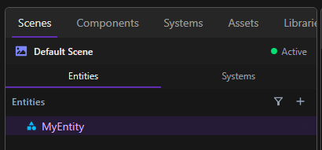
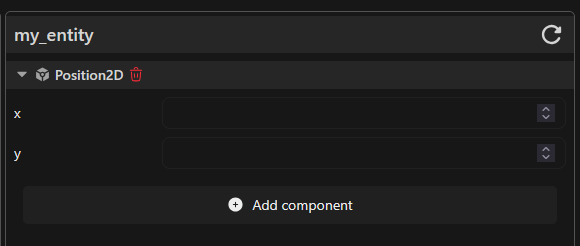

Components define the data and properties of an entity. On their own, they do not contain any logic. Instead, systems use them to determine how entities behave during the game.

## Navigate

To access your components, navigate to the **Components** tabs in the left panel.

## Create a component

In the **Components** panel, click **+** and **Create**. Enter a name for your component, and click **Confirm**.

 

## Import a component

In this **Components** panel, click **+** and **Import**.

Choose the components that you need, click **Install** in the top right corner, and click **Apply** when you install all components you want.

## Edit a component

To edit a component, navigate to **Components** tab, right-click the component, and click **Open code**. The component source file opens in the code editor.

## Add Component to an entity

Navigate to **Scenes** tab, and **Entities** subtab. Choose an entity and the component panel will be display on the right panel.

 

You can click **Add component** and select the component that you need.

## Change entity components data

You can modify the data of a component attach to an entity in the components inspector in the right panel.

