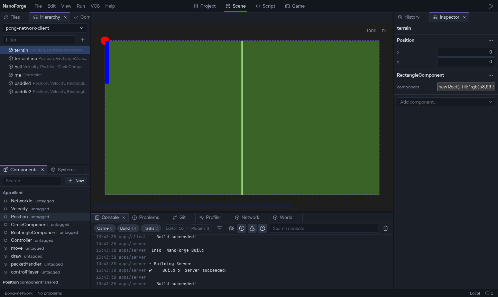

A component is the data of an entity: a position, a speed, a sprite. It holds no logic; [systems](systems) use it.

A component is a class:

```ts
/**
 * Where an entity is, in viewport pixels.
 * @component
 */
export class Position {
  name = 'Position';
  constructor(
    public x = 0,
    public y = 0,
  ) {}
}
```

## The Components panel



The panel lists the components (**C**) and systems (**S**) the selected app can use, grouped by where they come from:

- **App**: the app's own;
- **Shared library**: code shared by the client and the server;
- **Installed packages**: read-only, with a lock.

Select one to read its description, its parameters and where it is defined. The search box filters by name.

An item marked _untagged_ was recognized from the code but has no `@component` or `@system` tag: add the tag to make it explicit.

## Create a component

**New › New component in app**, then a name. The file is created in the app's components folder, with its tags, and opens in the code editor.

## Add it to an entity

Select an entity in the **Hierarchy**, select the component in the panel and click **Add to** the entity; or use **Add component…** in the Inspector. The component and its import are added to `main.ts`.

## Share between client and server

A **shared library** holds components and systems that both apps use.

- **New › New shared library…** creates it (a folder in `libs/` and a package name such as `@my-game/shared`).
- **New › New component in shared library** creates a component there.
- **Move to shared library** moves an app's component into it and rewrites every import in the project, in one step you can undo.

Apps import shared code by package name: `@my-game/shared/components/player`.

A new library is used by every app. The [Project screen](overview#the-project-screen) lists the libraries and chooses which apps use each one: an app is only offered the components and systems of the libraries it uses.

## Components from packages

Packages installed from [File › Packages…](plugins-and-packages) bring components you can use as they are. To change one, use **Copy to…**: it copies the component into your app or a shared library.

## How a component looks in the inspector

The author of a component chooses how its parameters show, with tags in the documentation comments. Nothing changes in the game.

```ts
/**
 * Where an entity is, in viewport pixels.
 *
 * @component
 * @group Coords color=#4aa3ff - Position from the top-left corner.
 */
export class Position {
  name = 'Position';
  constructor(
    /** Distance from the left edge. @group Coords @preset vector.x */
    public x = 0,
    /** Distance from the top edge. @group Coords @preset vector.y */
    public y = 0,
    /** Draw order. @label Layer @color orange */
    public z = 0,
    /** Draws the path the entity followed. @hidden */
    public trail = false,
  ) {}
}
```

| Tag                             | Effect                                                                                                               |
| ------------------------------- | -------------------------------------------------------------------------------------------------------------------- |
| `@group Name`                   | Puts the parameter in a foldable group. Declare the group in the class comment to give it a color and a description. |
| `@preset vector.x` / `vector.y` | Shows several parameters as one control. Presets: `vector`, `size`, `color`.                                         |
| `@label Text`                   | The name shown instead of the parameter's.                                                                           |
| `@color orange`                 | Colors the name.                                                                                                     |
| `@hidden`                       | Hidden by default; _Show hidden_ in the inspector reveals it.                                                        |
| The comment's text              | Shown behind the ⓘ next to the name.                                                                                 |

### Without writing tags

Open the component's file: the **Component** panel beside the code (a toggle in the editor's toolbar, or _Edit layout_ in the inspector's ⋯ menu) has a control for each of these, and a preview. It writes the tags for you.

## Two components with the same name

The engine finds a component by its `name`. When an app can use two components with the same name (yours and a package's), the panel warns, and the app's own is the one used.
