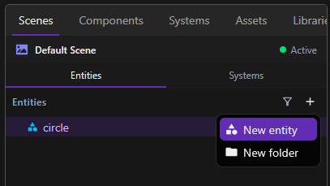
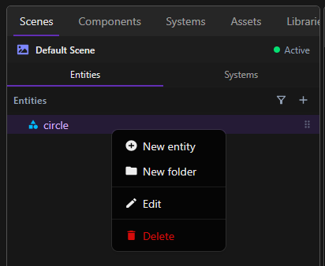

Entities are the basic objects of your game. They represent all the elements such as player, background, props, or any object.

## Create entity

To access entities, navigate to **Scenes** tab, and **Entities** subtab. Click to **New entity**. You can organize your entities in folder.

## Delete or Rename entity

To modify an entity, right-click on it and select **Edit**. Enter the new name and confirm the change. You can also select **Delete** to remove the entity.

