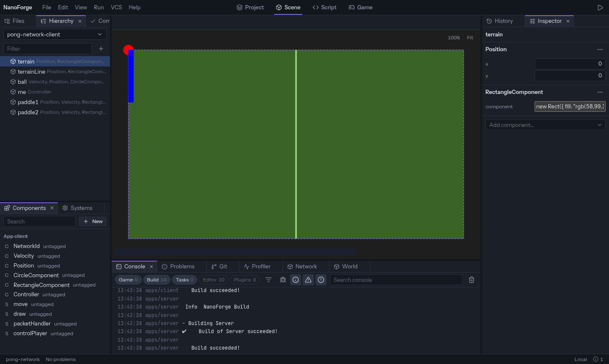

Entities are the objects of your game: the player, the ball, the background. An entity is only a name; **components** give it data, and **systems** make it act.

In NanoForge, entities are created in the app's `main.ts`: In a game made of [scenes](scenes), each scene creates its own in its `setup`, edited the same way.

```ts
const ball = registry.spawnEntity();
registry.addComponent(ball, new Position(960, 540));
```

The editor reads that file and shows it as a hierarchy. When you change something in the panels, it edits those lines. When you edit the lines by hand, the panels follow.



## Choose the app

A multiplayer game has a client and a server, each with its own entities. The selector at the top of the **Hierarchy** panel chooses which one you edit.

## The hierarchy

Entities are listed under the name of their variable (`ball`, `paddle1`), with their components beside it.

| To                | Do                                                                          |
| ----------------- | --------------------------------------------------------------------------- |
| Add an entity     | **Add entity** (the **+** button). Give it a name: it becomes the variable. |
| Rename            | `F2`, or right-click › Rename. The variable is renamed.                     |
| Duplicate, remove | Right-click                                                                 |
| Reorder           | Drag an entity up or down                                                   |
| Find              | The filter box matches names and components                                 |

Every change is one step of the file's history: `Ctrl+Z` undoes it.

### Entities "from code"

Entities created in a way the editor cannot model (in a loop, in a helper function, under a condition) are listed greyed, with a lock. They cannot be changed from the panels; _Open in code_ jumps to their lines. The editor never rewrites code it does not understand.

## The inspector

Select an entity: the **Inspector** shows its components, with one field per parameter.

- Change a value: only that value changes in the code.
- **Add component…** lists the components the app can use. The import is added for you.
- The **⋯** menu of a component removes it, opens its code, or edits how it is laid out.

Fields follow the parameter's type: numbers, text, lists of choices, switches, colors. A value the editor has no field for (an engine object such as `new Rect(…)`) is shown as code, which you can edit.

## The Scene screen

The **Scene** screen draws the entities of the app in 2D: each one at its position, with its rectangle or circle.

- **Click** a shape to select the entity.
- **Drag** it to move it: its position is written to `main.ts`.
- Scroll to zoom, drag the background to pan; **Fit** shows everything.

## While the game plays

The hierarchy and the inspector switch to the **running game**: values move as the game runs, and entities created at runtime are listed too. See [Play the game](play#edit-the-running-game).
