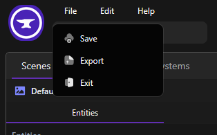
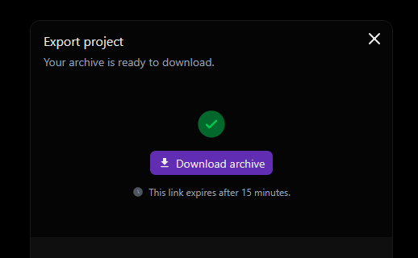

You can export your project to keep a local copy of your game.
Open the **File** menu and click **Export**.

Wait a few seconds for the archive to be generated, then click **Download archive**.
The download link remains available for 15 minutes.

