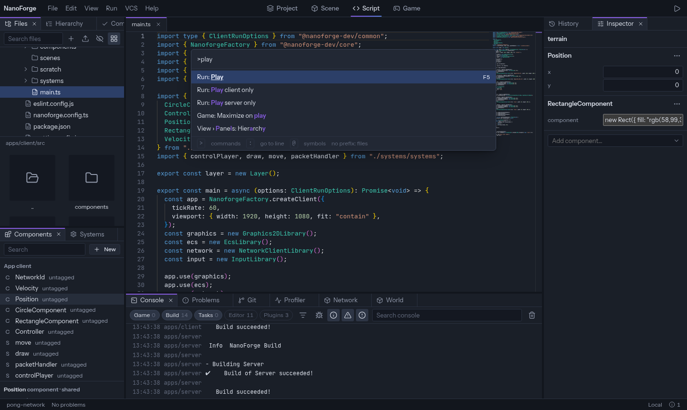

## Screens

The center of the editor shows one **screen** at a time, chosen in the top bar.

| Screen      | Shows                                                                                   |
| ----------- | --------------------------------------------------------------------------------------- |
| **Project** | The project's apps and shared libraries. See [The Project screen](#the-project-screen). |
| **Scene**   | The entities of an app, drawn in 2D. Select and drag them. See [Entities](entities).    |
| **Script**  | The code editor. See [Code editor](code-editor).                                        |
| **Game**    | The running game. See [Play the game](play).                                            |

## The Project screen

The Project screen lists what the project is made of, and changes it.

- **Apps**: each client and server, with its folder, its engine libraries and the shared libraries it uses. **Add app** creates a client or a server, empty or as a copy of another one. An empty app needs its dependencies: the editor offers to install them.
- **Shared libraries**: code that several apps use (see [Components](components#share-between-client-and-server)). **Add shared library** creates one. Under **Used by**, tick the apps that use it: the editor writes it in the `libs` of each app's `nanoforge.config.ts` (`libs: ["../../libs/shared"]`) and in its `package.json`. Edit `libs` by hand and the screen follows.
- The **⋯** menu of a card renames or removes it. Renaming a library rewrites every import of it. A library that code still imports can't be removed: the editor names the files.

Each change is one step you can undo with `Ctrl+Z` while the Project screen has the focus.

## Panels

Around the screen, **panels** sit in five docks: two on the left, two on the right, one at the bottom.

| Panel                    | For                                                                                      |
| ------------------------ | ---------------------------------------------------------------------------------------- |
| Files                    | The project's files and folders. See [Files](files).                                     |
| Hierarchy, Inspector     | Entities and their components. See [Entities](entities).                                 |
| Components, Systems      | What the app can use and what it runs. See [Components](components), [Systems](systems). |
| Commit, Git              | Changes, commits and branches. See [Git](git).                                           |
| History                  | Every change you can undo.                                                               |
| Console, Problems        | Output of the game and the editor; errors in the code.                                   |
| Profiler, Network, World | The running game, in detail. See [Play the game](play#inspect-the-running-game).         |

_View › Panels_ lists every panel, and shows one that was closed.

## Menus

- **File**: Packages…, Settings…, Close project.
- **Edit**: undo and redo.
- **View**: the command palette, panels, screens, docks, layouts, light or dark theme.
- **Run**: Play, Pause, Step, Restart, Stop, and the play modes.
- **VCS**: Git commands.
- **Help**: documentation.

Plugins add their own entries.

## The command palette

Press `Ctrl+Shift+P` and type what you want to do. Every action of the editor is there, with its shortcut.

The same box finds other things, depending on how the text starts:

| Type             | To                              | Shortcut       |
| ---------------- | ------------------------------- | -------------- |
| `>` and a name   | run a command                   | `Ctrl+Shift+P` |
| a name           | open a file of the project      | `Ctrl+P`       |
| `:12` or `:12:4` | go to a line of the open file   | `Ctrl+G`       |
| `@` and a name   | go to a symbol of the open file | `Ctrl+Shift+O` |

Letters only need to be in order, not next to each other. The commands you ran last are listed first.

## Undo

`Ctrl+Z` undoes the last change **of what has focus**: the file you edit, the Files panel, the layout. Each has its own history, so undoing a file move does not undo your code.

The **History** panel lists the steps of what you are working on. Click a step to go back to it; the _All_ switch shows every history.

## Problems and the status bar

The status bar shows the count of errors and warnings in the project's code; click it to open **Problems**, where each one opens its file at the right line.
