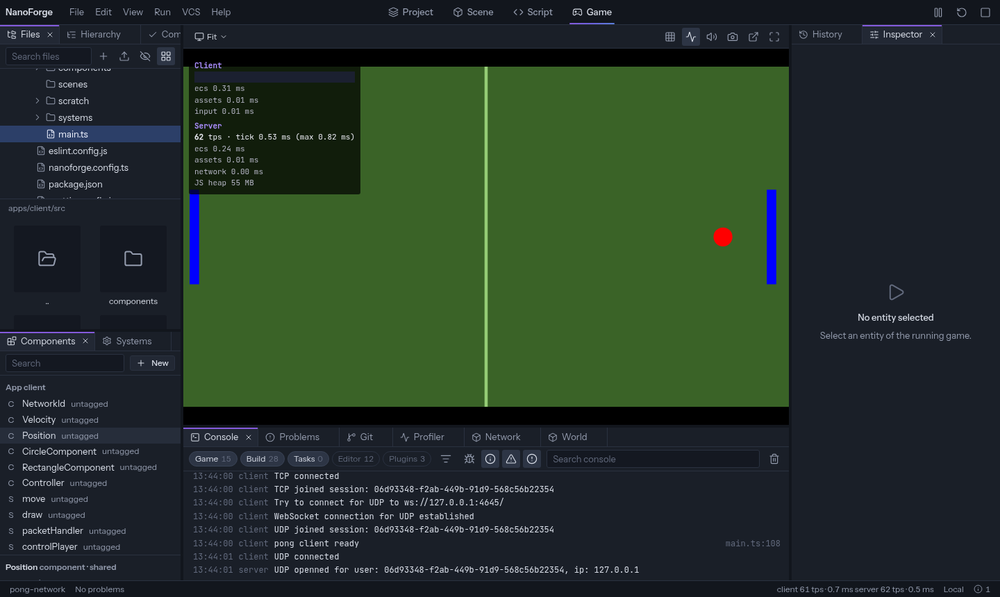
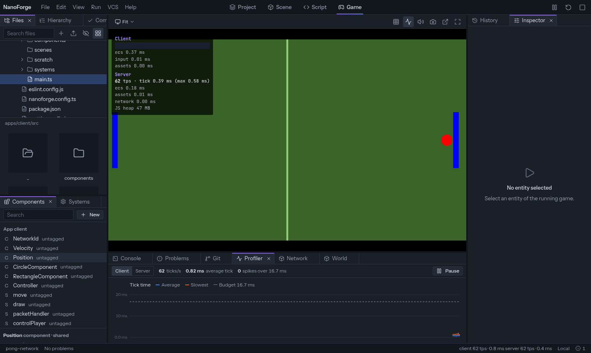

Press **Play** in the top bar, or `F5`. The editor saves your files, builds the game, and runs it in the **Game** screen.



| Action             | Shortcut                         |
| ------------------ | -------------------------------- |
| Play               | `F5`                             |
| Pause, then resume | the Pause button, `F5` to resume |
| Step one frame     | the Step button, while paused    |
| Restart            | `Ctrl+Shift+F5`                  |
| Stop               | `Shift+F5`                       |

The game gets the keyboard when it starts. Press `Escape` to give it back to the editor. Stopping returns to the screen you were on.

<Note>
  The game runs in a **local** editor (`nf editor`). A hosted editor never builds or runs project
  code.
</Note>

## Play modes

A multiplayer game has a client and a server. The **Run** menu chooses what plays:

| Mode                 | Runs                                                                   |
| -------------------- | ---------------------------------------------------------------------- |
| **Play**             | The server and a client (or the client alone when there is no server). |
| **Play client only** | The client, for a game whose server runs elsewhere.                    |
| **Play server only** | The server, without a game view.                                       |

_Settings › Runtime › Play mode_ sets what `F5` does. While the game plays, the Run menu can open **another client** in a new window, to test two players.

A project can have several clients or several servers. Play starts one of each: the Run menu then shows **Client app** or **Server app**, to choose which one. The choice is kept with the project, on your machine.

## The Game screen

The toolbar above the game:

| Tool           | Does                                                                                                                                      |
| -------------- | ----------------------------------------------------------------------------------------------------------------------------------------- |
| **Resolution** | _Fit_ fills the screen. Or a fixed size: 1920×1080, 1280×720, 1024×768, a phone, a tablet (with portrait or landscape), or a custom size. |
| **Zoom**       | For fixed sizes. _Pixel perfect_ keeps whole zoom steps and sharp pixels.                                                                 |
| **Stats**      | An overlay: ticks per second, tick time, the slowest libraries, memory.                                                                   |
| **Mute**       | Mutes the game's sounds and music.                                                                                                        |
| **Screenshot** | Saves the game as a PNG in the project's `screenshots/` folder and copies it.                                                             |
| **Pop out**    | Moves the running game to its own browser window. Closing it brings the game back.                                                        |

While paused, the game is dimmed with a _Paused_ badge. The status bar shows the speed of the client and the server.

## The console

The **Console** shows what the game prints, the output of builds, and messages of the editor and its plugins.

- **Chips** at the top show or hide groups: Game, Build, Tasks, Editor, Plugins. A dot on a hidden group means it holds warnings or errors.
- **Levels**: debug, info, warnings, errors. **Search** filters by text.
- A logged **object** shows as one line that expands into a tree.
- A **file path** in a line is a link: it opens the file at that line. Lines of the game show where they were logged (`main.ts:12`).
- Identical lines in a row are grouped with a count.

## Edit the running game

While the game plays, the **Hierarchy** and the **Inspector** show the live world of the client or the server (the selector at the top of the Hierarchy chooses which).

- Change a value in the Inspector: the **running game** changes at once. The code does not.
- Add or remove a component, spawn or remove an entity: same.
- In the **Scene** screen, drag a shape to move the entity in the running game.
- In the **Game** screen, turn on **Move entities** in its toolbar: the entities are outlined over the game, and you drag them there the same way. While it is on, the pointer goes to the editor, not to the game. In a networked game the server sends the positions of what it owns: pause the game before moving those, then apply.
- **Apply to code** writes the changes of an entity to `main.ts`. Entities spawned at runtime exist only in the game and cannot be applied.
- In the **Systems** panel, switch a system off to see the game without it.

Stopping the game drops the changes that were not applied; the editor offers to apply them first. The ECS setting _Apply live edits to code_ writes every live change to code as it happens.

## Inspect the running game

Three panels at the bottom, each with a Client / Server selector.



- **Profiler**: tick time over the last two minutes, against a budget line (16.7 ms by default); spikes are marked. Below, the time per engine library and **per system**. Click the chart to freeze it on a moment.
- **Network**: the packets sent and received, with their size and decoded content; filters by direction, transport and text; charts of bytes and packets per second.
- **World**: every entity of the running game with its components, read-only, with a search: `Position` (has the component), `Position.x > 100`, `#12` (an entity id).

They ask the game for data only while they are shown.

## When something fails

- A **build error** stops Play: the error is in the Console and in **Problems**, with its file and line.
- A game that **crashes** shows its error in the Console; links in the stack open your source files.
- A game that does not register the **editor library** still plays, without pause, stats, live editing and the inspectors; the editor says so. Click **Add the editor library** in its message, or add it yourself to the app's `main.ts`, then play again:

  ```ts
  import { EditorLibrary } from '@nanoforge-dev/editor-lib';

  app.use(new EditorLibrary());
  ```

  It does nothing when the game is not started by the editor. It needs NanoForge engine 2.0 or later: with an older engine, update the engine packages.
