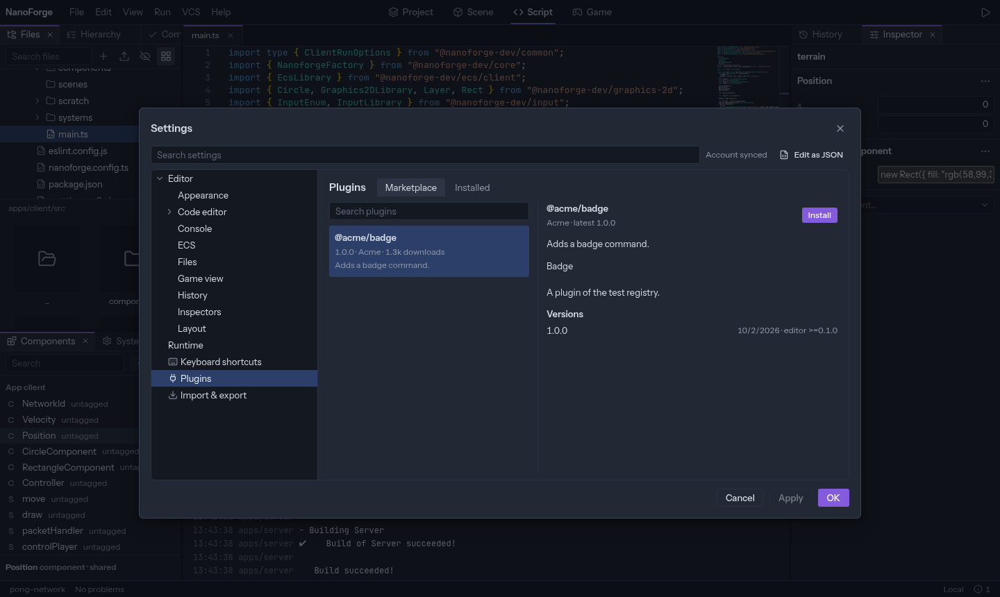
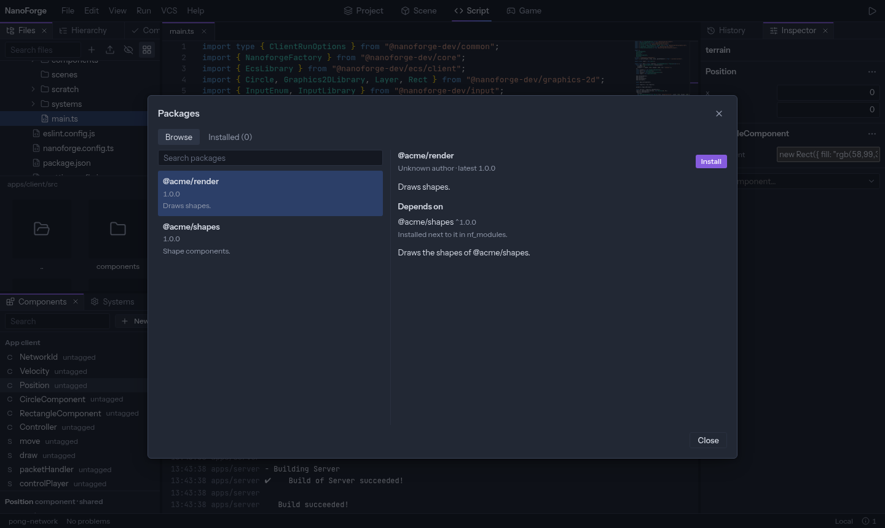

Two different things can be installed:

- a **plugin** adds something to the **editor**: a panel, a tool, a command;
- a **package** adds something to your **game**: components, systems, assets.

Installing is for local editors.

## Plugins

_File › Settings… › Plugins_.

### Marketplace

Search, select a plugin to read about it, then **Install**:

- **For me**: in every project you open on this machine;
- **For this project**: in the project's `.nanoforge/plugins` folder, which can be committed so the whole team has it.

A plugin starts working after a reload of the editor: the page offers **Reload now**. When a newer version exists, **Update** shows instead of _Installed_.

### Installed

Every plugin of the editor, with its version and where it comes from. The switch turns a plugin off (after a reload). Plugins installed from the marketplace can be **updated** and **uninstalled** here; built-in ones cannot.

### Plugins a project suggests

A package can suggest plugins that make it easier to use. When a project opens with such packages and the plugins are missing, the editor says which.

## Packages

_File › Packages…_

### Browse

Search, select a package to see what it depends on, then **Install**. The package and the packages it needs go to the project's `nf_modules` folder, and their components and systems show in the [Components](components) panel at once.

### Installed

The project's packages, with their version. **Update** moves one to a newer version; **Uninstall** removes it, with the packages only it needed. A package that another one needs cannot be removed first.

### What is written in the project

| File                           | Holds                                                                            |
| ------------------------------ | -------------------------------------------------------------------------------- |
| `nanoforge.packages.json`      | The packages the project asks for. Commit it.                                    |
| `nanoforge.packages.lock.json` | The exact versions installed. Commit it.                                         |
| `nf_modules/`                  | The packages themselves. Read-only in the editor.                                |
| `tsconfig.json`                | Import paths, so code imports a package by name: `@acme/shapes/components/hull`. |

`nf_modules` can be left out of Git: on a fresh clone, the Packages dialog sees what is missing and offers **Restore packages**.

### Changing a package's component

Packages are read-only. In the Components panel, **Copy to…** copies a component into your app, where it is yours to edit.

## Writing your own

See [Plugins](../plugins/overview).
