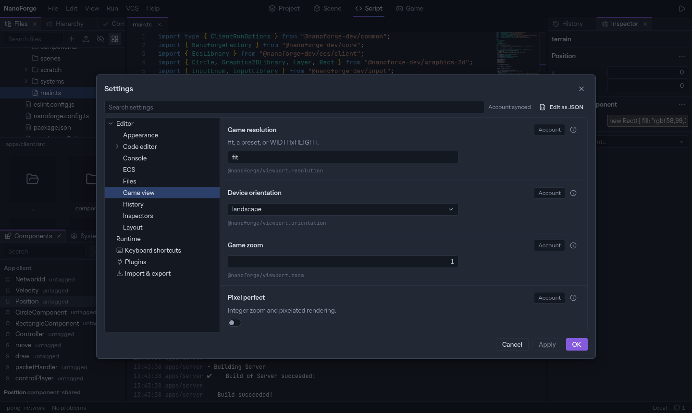
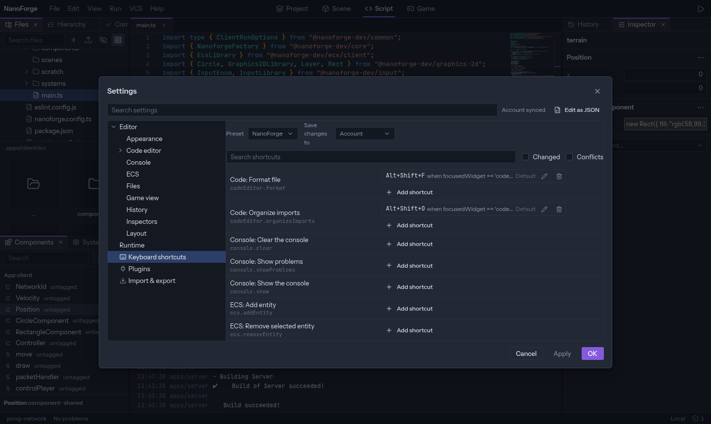

Open the settings with _File › Settings…_ or `Ctrl+Alt+S` (also `Ctrl+,`).

Categories are on the left, their settings on the right. The search box looks through every category. Changes wait until you press **Apply** or **OK**; **Cancel** drops them.

## Where a setting is saved

Each setting has a small menu that chooses where your change goes:

| Scope                 | Saved                                            | Use it for                          |
| --------------------- | ------------------------------------------------ | ----------------------------------- |
| **Account**           | With your account                                | Your preferences, wherever you work |
| **This machine**      | In this browser                                  | What depends on this computer       |
| **Project**           | In `.nanoforge/editor/settings.json`, committed  | What the whole team should share    |
| **Project (only me)** | In `.nanoforge/editor/local.json`, not committed | Your preferences for this project   |

When several scopes have a value, the more specific one wins: Project (only me), then Project, This machine, Account. The **inspect** popover of a setting shows its value in each scope and resets one.

_Edit as JSON_ opens the project's settings file in the code editor, with completion.

## Import and export

The _Import & export_ page saves a scope to a `.json` file, and loads one with a preview of what would change.

## Keyboard shortcuts

The _Keyboard shortcuts_ page lists every action with its shortcuts.

- **Search** by name or by shortcut (`ctrl+s`). The filters show only what you changed, or conflicts.
- **Add shortcut** on an action, then press the keys. Press a second combination to make a chord (`Ctrl+K` then `Ctrl+S`).
- When the shortcut is already used, the dialog names the other action: keep both, replace, or cancel.
- **Reset** puts an action back to its default.
- A **preset** changes many shortcuts at once: _NanoForge_ (the defaults), _VS Code_, _Godot_. Your own changes apply on top.

Shortcuts are saved to your account, or to this machine only.

## Plugins

The _Plugins_ page lists the plugins, turns one off, and installs more: see [Plugins and packages](plugins-and-packages).

## Sync

The top of the dialog shows the state of the account sync. After working offline on two devices, a _Sync conflicts_ page lets you choose, for each setting changed on both, which value to keep.
