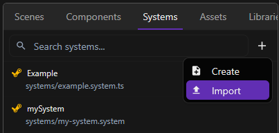
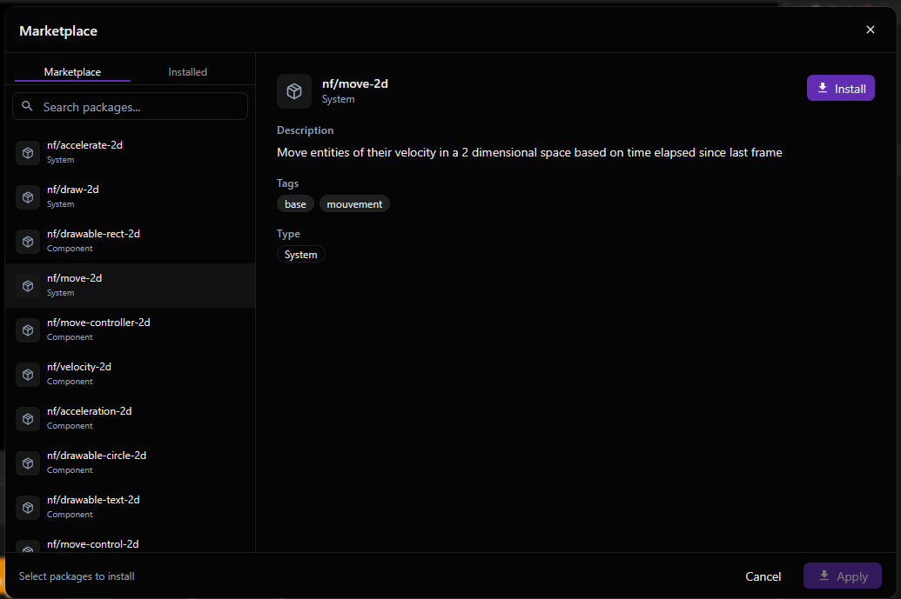
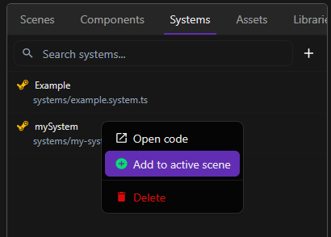
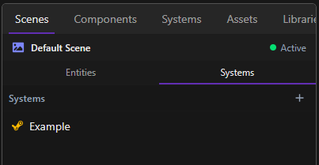

Systems contain the logic of your game. They are executed while the game is running and define the behavior of your entities.

## Navigate

To access your systems, navigate to the **Systems** tabs in the left panel.

## Create a system

In the **Systems** panel, click **+** and **Create**. Enter a name for your system, and click **Confirm**.

 

## Import a system

In this **Systems** panel, click **+** and **Import**.

A list of system appear, you can now choose a system, click **Install** in the top right corner, and click **Apply** when you install all systems you want.

## Add system to the scene

There are two ways to add a system to a scene.

### 1. Add to the active scene

In the **Systems** tab, right-click on the system you want and select **Add to active scene**

### 2. Pick a system on your scene

Navigate to **Scenes** tab, and select the **System** subtab. Click **+**, choose a system from the list, and click **Confirm**.

## Edit a system

To edit a system, navigate to **Systems** tab, right-click the system you want edit, and click **Open code**. The system source file opens in the code editor.

