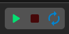
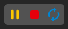

# The Viewport

The viewport is a preview of your game, where you can run it and interact while editing.

## Edit mode

When the game is not running, the viewport toolbar displays two available buttons: Click **Play** (left) to start the game in the viewport and **Reload** (right) to restart the game with the last changes.

## Play mode

When the game is running, the toolbar displays three buttons. Click **Pause** (left) to pause or resume the game, **Stop** (middle) to stop the game and **Reload** (right) to restart the game with the last changes.
