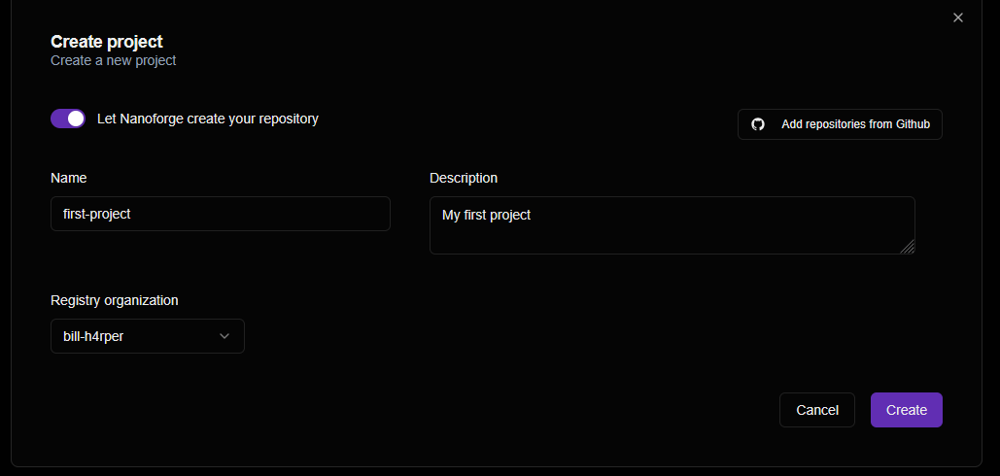
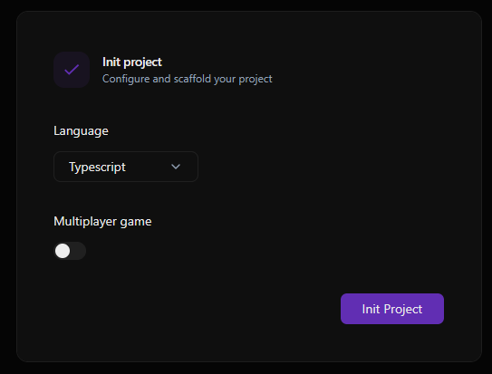
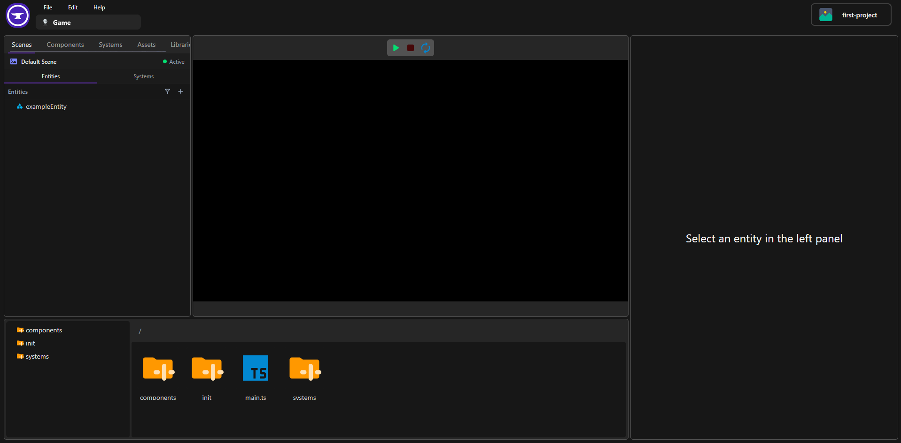

To create your first game, start by creating a project from the [Project Dashboard](https://projects.nanoforge.eu/dashboard/projects). Click **New project** and fill the project information.

If you want to automatically link your project to a github repository, click **Add repositories from github** and select the organization you want to use.

Once your project has been created, click **Open Editor** to launch it in the Nanoforge Editor. This will open the project initialization page, where you choose your programming language and select either a single-player or multiplayer game.

After the project is initialized, you will be redirected to the editor, which is composed of several panels:

- **Center**: The **Viewport**, where you can preview and interact with your game while editing.
- **Left**: The **Project Explorer**, where you can manage your scenes, entities, and systems. You can also switch between the Components, Systems, Assets, and Libraries tabs.
- **Right**: The **Inspector**, which displays the properties of the selected entity and lets you add, remove, or edit its components.
- **Bottom**: The **File Explorer**, where you can browse your project files and open them to start coding.

