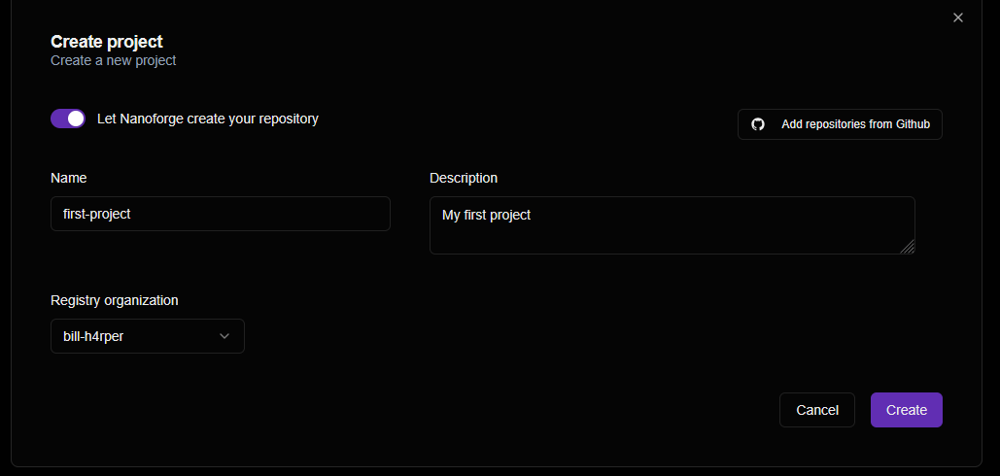
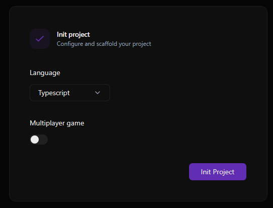

## Online

Create a project from the [Project Dashboard](https://projects.nanoforge.eu/dashboard/projects). Click **New project** and fill in the project information.



To link the project to a GitHub repository, click **Add repositories from github** and select the organization to use.

Once the project is created, click **Open Editor**. The first time, a page asks for the programming language and whether the game is single-player or multiplayer.



## On your machine

With the NanoForge CLI:

```sh
nf new                   # asks for a name, a language, and whether the game has a server
nf editor my-game        # starts the editor and opens the project in your browser
```

`nf editor` without a path opens the list of recent projects. A local editor works on the folder itself: what you change in the editor is on your disk at once, and what you change on disk shows in the editor.

A local editor can do what a hosted one cannot: run the game, use Git with your own credentials, and install plugins and packages.

## The editor


- **Top**: the menu bar, the four main **screens** (Project, Scene, Script, Game), and the **Play** button.
- **Left**: **Files**, the **Hierarchy** of entities and the **Commit** panel; below, **Components** and **Systems**.
- **Right**: **History** and the **Inspector**.
- **Bottom**: the **Console**, **Problems**, **Git**, and the **Profiler**, **Network** and **World** panels.
- **Status bar**: the project, the count of problems, the Git branch, and the game's speed while it plays.

Every panel can be moved, floated or closed: see [Layout](../editor/layout).

## Next

1. Open the **Scene** screen and select an entity in the **Hierarchy**: its components show in the **Inspector**. See [Entities](../editor/entities).
2. Press **Play** (`F5`). See [Play the game](../editor/play).
3. Open `apps/client/src/main.ts` from **Files**. See [Code editor](../editor/code-editor).
