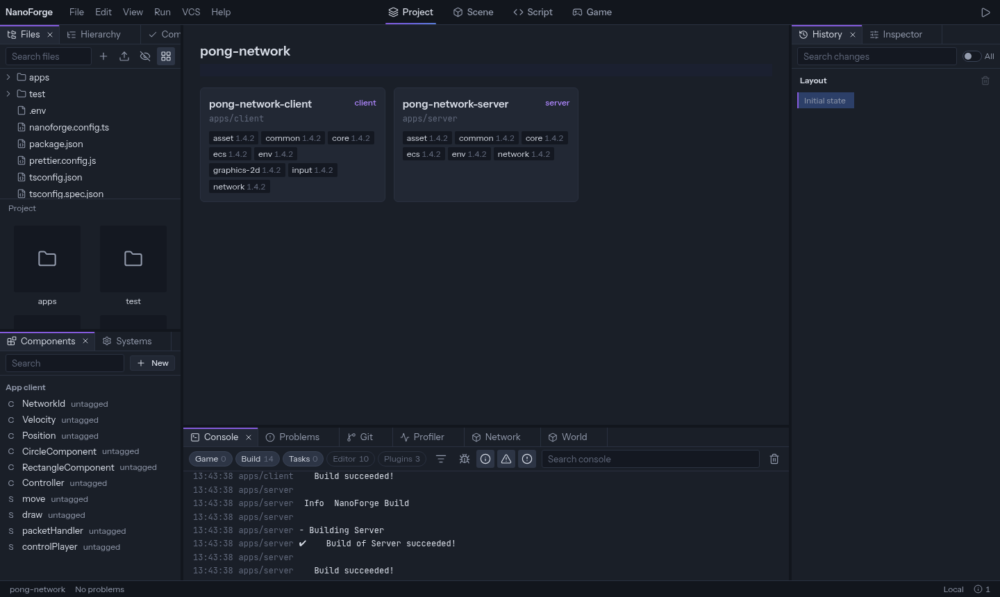

The NanoForge editor is where you build a NanoForge game: its files, its code, its entities, components and systems, and the game itself, running next to them. It runs in the browser, either hosted or on your machine with `nf editor`.

A NanoForge game is **code**. The editor does not keep a scene file of its own: when you add an entity or change a value, it edits your `main.ts`, and what you write by hand shows in its panels.

## Start here

- [Create your first project](create-your-first-project)
- [Find your way around](../editor/overview)

## Using the editor

- [Layout](../editor/layout): panels, screens, saved layouts
- [Files](../editor/files)
- [Code editor](../editor/code-editor)
- [Entities](../editor/entities), [Components](../editor/components) and [Systems](../editor/systems)
- [Play the game](../editor/play): play modes, the Game screen, the console, live editing
- [Settings and shortcuts](../editor/settings)
- [Git](../editor/git)
- [Plugins and packages](../editor/plugins-and-packages)

## Extending the editor

- [Plugins](../plugins/overview): write your own panels, commands and tools
